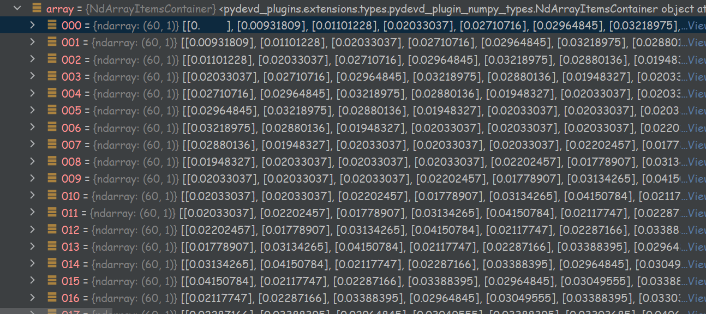

# 用时间序列模型学习股票收盘价，预测未来价格

## 项目介绍：

在上小学数学课的时候，你一定做过这样的题目：给出一段数字，让你找出其中的规律，然后给出自己的答案


在我们做题的过程中，究竟发生了什么？是用什么样的方法以及思路来完成这些题目的？

仔细思考不难察觉，我们做题目大致可以分为这几个流程

1. 观察部分的数据 
2. 基于这些数据给出一个假定的规则（猜）
3. 观察更多的数据，查看我们的规律是否适用于其他数据
4. 如果这一假定的规则适用于当前的数据，则回到3
   如果不适用于当前的数据，则回到2
5. 重复这些步骤，直到我们的假定的**规则**适用于所有的数据
   这时，就可以将这一规则当做 这一组数据的**规律**了

对于一个数学题来说，思考到这里就足够了，因为对于这样一些人为设计的题目，数据是有限的，所以规律是确定的。

但我们是否可以将这样的思路运用到现实中无穷尽的金融数据中，不止步于找到规律上,而是继续用这个规律来预测未来的数据

答案是肯定的，使用机器学习的时间序列模型，我们可以利用其学习股票收盘价获得其中的“规律”，并给出未来价格的预测值

(但事实上，因为金融数据的特殊性，我们永远也不可能基于这些数据得到一个确定的，恒定的规律，
但模型预测值的参考价值是不可否定的)


## 1. 准备工作

```
开发环境 :
Python版本: 3.8
TensorFlow版本: 2.5.0  
其他必要的依赖库：matplotlib、numpy、pandas……略

使用的包(环境)管理：
Anaconda

使用的IDE：
pycharm

使用的数据平台：
大智慧365平台
```

## 2. 数据采集与(部分)预处理：

使用大智慧365平台获取浦发银行2014-8-28至2020-12-11的1500条相关股票价格信息（步骤略）：


### 数据预处理-1：

使用excel截取 日期与收盘价格(该步骤也可以在项目工程文件中用代码实现，但是用excel更加友好)


### 数据预处理-2:

将(暂时)处理好的数据文件格式转换为（另存为）.csv文件，存放在工程目录中


这是为了更好地支持pandas库中的read方法

## 3. 目前数据的可视化展示：

### 导入依赖库

```python
import matplotlib.pyplot as plt  
import numpy as np  
import pandas as pd  
```

matplotlib用于数据的可视化展示

numpy用于数据格式化等操作

pandas用于数据分析

### 读取源数据：

```python
df = pd.read_csv('data0.csv', names=['Date', 'Close'])  
df['Date'] = pd.to_datetime(df.Date, format='%Y-%m-%d') 
df.index = df['Date']  #将Date数据设置为数据集的索引
```

第1行代码用相对路径读取了项目目录下名为data0.csv的文件，并将其文件命名为df，数据的第一和第二列命名为Date 和 Close(分别代表股票日期以及该日期中的股票收盘价格)

 接着使用pandas库的to_datetime()函数，将参数（df.Date）按照指定格式( 年-月-日)转换成日期格式

### 可视化展示目前存储在项目内存中的数据：

```python
plt.figure(figsize=(16, 8))  # 设置显示图片的尺寸为16*8
plt.plot(df['Close'], label='收盘历史价格')  
# 使用matplotlib库中的plot函数生成图片；数据为数据集中的Close(收盘价格)，标签参数label设置为'收盘历史价格'
plt.show()
```


## 4. 模型训练前的准备——分割数据集与进一步的数据处理：

### 分割源数据为训练与验证集：

由于我们的源数据是时间序列，不能使用随机分割。所以将最开始4年(987个)的数据作为训练集，之后的所有数据设置为验证集

首先进行格式化处理，将原始数据集(data0.csv)转换成Pandas库提供的DataFrame  ,从而较好地用numpy提供的函数生成时间序列作为模型训练数据

#### 数据格式转换：  .csv中的数据 → Pandas的DataFrame：

```python
# 先排序（这一步不是必要的，因为excel已经帮我们做好了，但在后续的操作前先用sort()是一个好习惯）
# 使用sort_index()函数根据列标签对所有列排序；参数ascending：默认True 表示升序排列 ；参数axis：0 表示按照行名排序
data = df.sort_index(ascending=True, axis=0) 


# 数据格式转换
# 使用Pandas的构造函数DataFrame()创建数据框架new_data 索引为0到原始数据集的长度，第一列为Date，第二列为Close
new_data = pd.DataFrame(index=range(0, len(df)), columns=['Date','Close'])  
# 遍历新建立的数据框架new_data，用原始数据集df的数据对其进行赋值
for i in range(0, len(data)): 
    new_data['Date'][i] = data['Date'][i]    
    new_data['Close'][i] = data['Close'][i]  
```

#### 为DataFrame设置索引：

```python
# 设置索引
new_data.index = new_data.Date  # 数据框new_data的索引直接用原始数据集的数据赋值
```

#### 删除源数据集的Date日期

```python
new_data.drop('Date', axis=1, inplace=True)  # 删除源数据集的Date日期
# 参数'Date’为要删除的数据名称；axis=1表示删除的是一列（column）；inplace=True，表示直接在源数据集上进行删除操作
```

为什么要这么做？

因为Date对于我们的模型来说没有任何意义，属于不必要的数据，对于模型的训练我们只需要用到Close

但是为了让Close保存属于**时间序列**的特性，我们需要在后续进行其他操作（数据类型设置为数组）

#### 分割：

```python
dataset = new_data.values  # 将new_data的数据直接赋值(命名为)dataset
train = dataset[0:987, :]  # 将最开始4年(987个)的数据作为训练集
valid = dataset[987:, :]  # 之后的所有数据设置为验证集
```

### 进一步的数据处理：

目前我们已经将原始的数据集分割成了训练和验证集

但是这些数据集中的数据，还不满足模型的要求（即缺少时间序列的特性）

为了达到这一点，我们要其中的数据存储为数组的格式

同时因为时间序列模型运算的特性（这里不多展开了，有兴趣可以[什么是长短时记忆网络LSTM？【知多少】](https://www.bilibili.com/video/BV1gy4y1q7M5?from=search&seid=3906391413814957491&spm_id_from=333.337.0.0)）,我们要将数据的范围压缩至0到1之间。

所以要做的工作：1. 压缩（数据集中的）数据范围 2.修改（数据集中的）数据格式

#### 1.压缩：

```python
from sklearn.preprocessing import MinMaxScaler  # 从sklearn.preprocessing库中导入MinMaxScaler
# 实现scaler()函数帮助将数据的范围压缩至0到1之间，这么做的目的是为了防止数值爆炸
# 为什么?: LSTM模型的计算中，时间步长越大，结果所迭代的次数就越多；如1.1的100次方为13 780.61233982，所以使用scaler()函数是必要的
scaler = MinMaxScaler(feature_range=(0, 1)) 
scaled_data = scaler.fit_transform(dataset)
```

#### 2. 修改数据格式：

```python
x_train, y_train = [], []  # 创建x_train, y_train
for i in range(60, len(train)):  # 循环结构，i的值分别为60,61，……直至train的长度(1500)
    x_train.append(scaled_data[i - 60:i, 0])  # 将scaled_data中的数据传递到x_train中(60个为一组)
    y_train.append(scaled_data[i, 0])  # 将scaled_data中的数据传递到y_train中(从第60开始，每1个数据为一组)

# 使用numpy库中的array()函数将列表x_train和y_train格式化为数组
x_train, y_train = np.array(x_train), np.array(y_train)  
# 使用numpy库中的reshape()函数改变数组x_train的形状
x_train = np.reshape(x_train, (x_train.shape[0], x_train.shape[1], 1)) 
```

上述的步骤将训练集的格式从列表(**list**)变成**时间步长为60**的时间序列(数据格式表现为**数组**)

在x_train的每一个数组元素中，都是一个包含60个scaled_data的list，所以可以将其当做一个二维数组（ 一个927行 60列的矩阵）



至此，我们已经完成了数据的预处理，现在可以进入模型的参数设置部分了

## 5. 模型的参数设置：

### 导包：

```python
# 导入神经网络需要的包
from keras.models import Sequential  # 从keras.models库中导入时间序列模型Sequential
from keras.layers import Dense, LSTM  # 从keras.layers库中导入Dense, Dropout, LSTM用于构建神经网络
```

### 创建LSTM神经网络：

```python
model = Sequential()  # 设置模型为Sequential

# 第一层网络设置
model.add(LSTM(units=50, return_sequences=True, input_shape=(x_train.shape[1], 1))) 
# unit 决定了一层里面 LSTM 单元的数量。这些单元是并列的，一个时间步长里，输入这个层的信号，会被所有 unit 同时并行处理，形成若干个 unit 个输出。这个设置50个单元
# return_sequence参数表示是否返回LSTM的中间状态，这里设置为TRUE，返回的状态是最后计算后的状态
# input_shape参数包含两个元素的，第一个代表每个输入的样本序列长度，这里是x_train.shape[1]，表示x_train数组中每一个元素的长度即时间步长，这里先前设置为了60
# 第二个元素代表每个序列里面的1个元素具有多少个输入数据(这里是1表示只有1个数据：时间)

model.add(LSTM(units=50))  # 第二层神经网络，设置50个LSTM单元

model.add(Dense(1))  # 第三层为全连接层：每一个结点都与上一层的所有结点相连，用来把前边提取到的特征综合起来
```

## 6. 训练模型：

由于我们已经做好了数据预处理 已经模型参数的设置，所以这一步是最简单的，只要传入数据到模型中然后启动训练即可

```python
model.compile(loss='mean_squared_error', optimizer='adam')  # 设置损失函数compile()参数
# loss参数指标使用MSE(均方根误差) ，optimizer参数设置优化器为AdamOptimizer(自适应矩估计，梯度下降的一种变形)
model.fit(x_train, y_train, epochs=1, batch_size=1, verbose=2)  # 传入数据开始训练模型
```

loss参数用来定量地评判我们模型训练的好坏

（运行项目时的loss输出）


## 7. 用训练好的模型来预测

### 一些准备工作

```python
# 用过去的每60个数据预测接下来的数据(时间步长为60)
inputs = new_data[len(new_data) - len(valid) - 60:].values        
# 用new_data数据集(格式化后的原始数据集df)中的数据赋值给新list，名为inputs
inputs = inputs.reshape(-1, 1)                                                   
# 用numpy库中的reshape()函数改变inpus的的形状
inputs = scaler.transform(inputs)                                            
# 传入inputs，将其用scaler()函数正则化

X_test = []  # 创建名为X_test的list
for i in range(60, inputs.shape[0]):                                           
# 赋值，73行到76行的步骤思路和代码41到45行一样，这里不再赘述
X_test.append(inputs[i - 60:i, 0])
X_test = np.array(X_test)
X_test = np.reshape(X_test, (X_test.shape[0], X_test.shape[1], 1))
```

### 传入数据执行预测，并处理预测数据（放大压缩的数据）：

```python
#模型执行预测
closing_price = model.predict(X_test)      

# 将预测值的数据传递到新list中，名为closing_price
closing_price = scaler.inverse_transform(closing_price)            
# 用scaler.inverse()函数将数据重新放大(在第18行开始的数据预处理中，使用了scaler()函数对数据进行了压缩)
```

## 8. 预测结果的可视化展示

```python
train = new_data[:987] # 将new_data的前987项数据赋值给train列表
valid = new_data[987:] # 将new_data的后面所有数据赋值给vaild列表
valid['Predictions'] = closing_price 
# 将closing_price赋值给vaild列表(这个操作覆写了987项数据之后的所有收盘价格，更新为模型的预测价格)

plt.figure(figsize=(16, 8))               # 设置图片尺寸
plt.plot(train['Close'])                  # 向图片载入train列表的'Close'列数据(收盘价
plt.plot(valid[['Close', 'Predictions']]) # 向图片载入vaild列表中的预测数据
plt.show()                     
```

